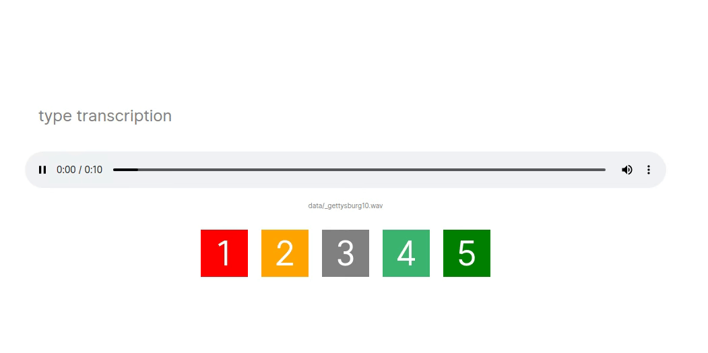

#Audio validator


Audio transcriber/validator for STT



##Run in current directory:
```
git clone git@github.com:slavaGanzin/auditor.git
cd auditor
npm start
```

Folder *data* will be transcibed by default.
You can change folder:
  - specify in cli `./server path/to/data/folder`
  - change package.json *run* section
  - [use electron app](##build-cross-platform-electron-app)


## Processing
Enter transcription **and grade audio quality** to go to next file


## Shortcuts
|key|action|
|---|---|
`ctrl +`/`ctrl =` | volume up
`ctrl -` | volume down
`left` | rewind 1 second
`right` | forward 1 second
`ctrl left` | rewind 10 second
`ctrl right` | forward 10 second
`down` | skip file
`up` | return to skipped
`space` | start/stop
`escape` | back to listening
`1 2 3 4 5` | grade audio quality and move to next file


## Expected input

- *data* folder can contain any subfolder structure
- audio (wav|mp3|opus|ogg) file has paired .txt file with transcription


## Processing life-cycle

*validated* folder will be created at the same level as your data folder:
```
data/
  non processed audio files
validated/
  processed audio files
  validated.csv

```
Processed files will be **moved** to *validated* folder.

validated.csv fields:
- transcribed text,audio quality score
- transcription date
- seconds operator was working on transcription

```sh

cat validated.csv

Four...,gettysburg10.wav,5,2020-11-08T08:27:08.003Z,10.003084
This course...,sample.wav,5,2020-11-08T08:27:14.868Z,6.257778

```

##Build cross-platform electron app
*and you will get nifty folder selection for free*

```
npm run build

# Executables are:
# linux
build/auditor-linux-x64/auditor

# Mac Os
build/auditor-darwin-x64/auditor

# Windows
build/auditor-win32-x64/auditor
```
